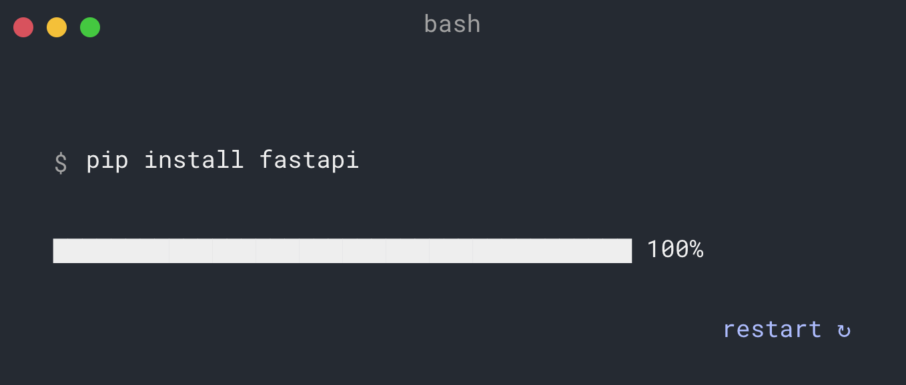

# student-management-system-using-fast-api
student management system using fast api

API development done using Fast API

## Installation

* clone the repo
* Install the following dependenices.
  * Install Fast API
  
  * Install uvicorn for server
